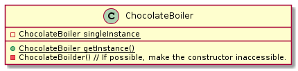
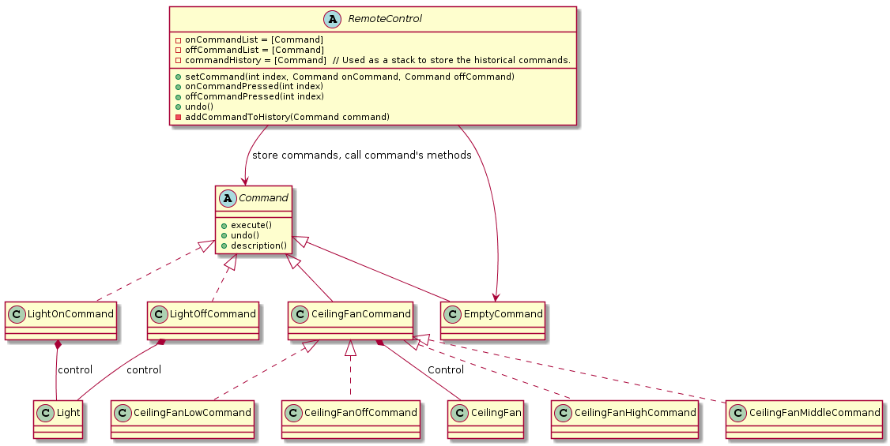
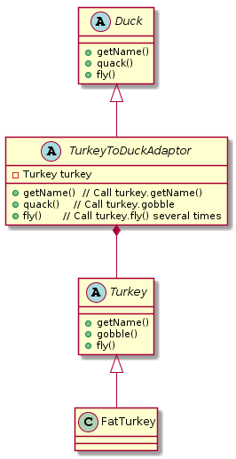
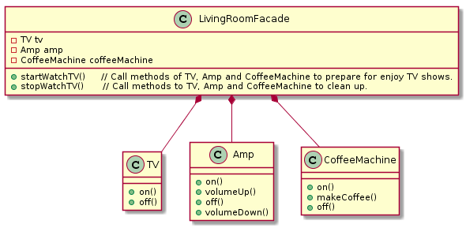
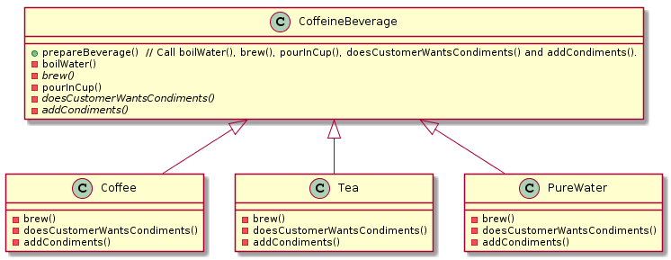
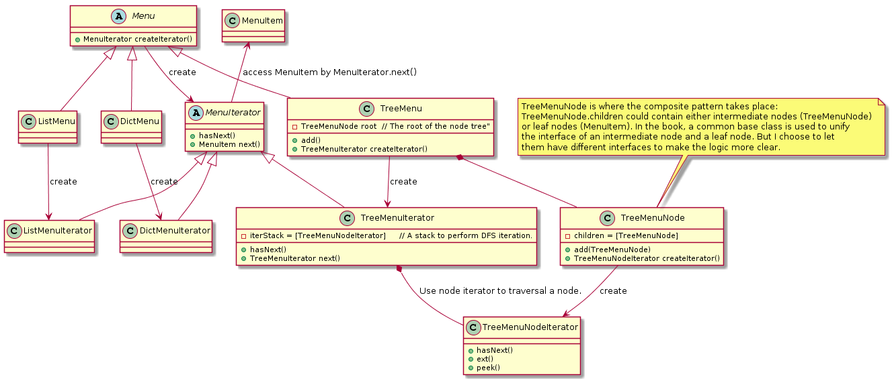
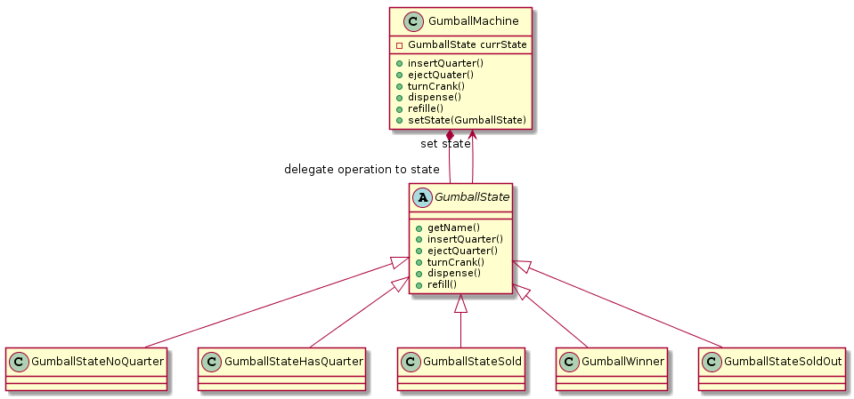
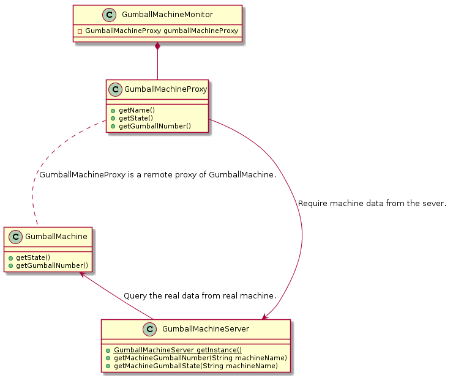
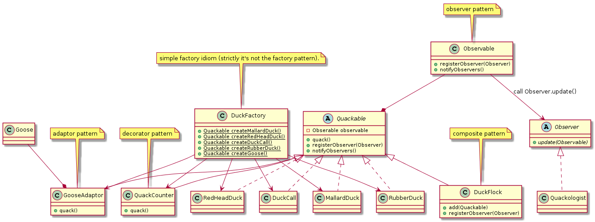
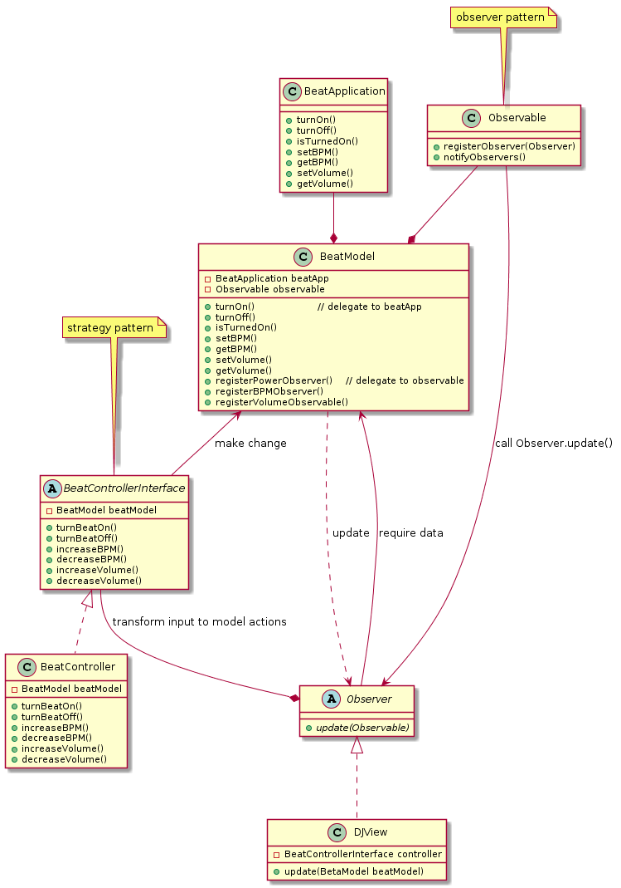

# Head First Design Patterns

This is the example/trial codes I write while reading the book: *Head First Design Pattern*.

## Chapter 1: Strategy Pattern
Delegate some behaviors to some other class by composition.
Composition makes it possible to change the behavior in runtime, but it also require us to write a lot wrapper functions. 

## Chapter 2: Observer Pattern
Register an object implementing the Observer interface, and call its update method when need to notify it that something has happened.

## Chapter 3: Decorator Pattern
Wrap a method, adding some additional functions.

## Chapter 4: Factory Method Pattern
Encapusulate the concrete class creation into interfrace method, so the client codes could create object from interfaces.

## Chapter 5: Singleton Pattern
Use static instance object to make sure there can only be one single instance of a class.

## Chapter 6: Command Pattern
Encapsulate actions into objects, then these actions could be stored / operated as data.

## Chapter 7: Adaptor(Adapter) and Facade Pattern
Adaptor pattern wrap the interface of one class to the interface of another class, in order to let the instance of the first class to work where the latter is required.

Facade pattern make a simpler interface to operate the object of a complex class (or a set of objects of different complex classes). The lost is we can't directly control some parameters.

## Chapter 8: Tempalte Pattern
Delegate some steps in a algorithm to other classes (like child classes).

## Chapter 9: Iterator and Composite Pattern
The iterator pattern is used to encapsulate the details of iterating the elements in a collection, which may be very complex, such as accessing each node in a tree in DFS order.

Composite pattern is used to handle a collection of elements in the same way as handling a simple element. 

## Chapter 10: State Pattern

To avoid write a huge logic full of "if" and "switch", we can adapt the state pattern to divide complex logics and encapsulate each part into a state object. This make the code easy to ready, and changes to one state don't affect the other states. 

## Chapter 11: Proxy Pattern
The goal of proxy pattern is to control the access. There are a lot different types of proxy, here I tried the remote proxy.

## Chapter 12: CompoundPattern and ModelViewController

In real application, we may need to use a lot of patterns together to solve one problem. So compund pattern is to put several patterns together.

The model-view-controller pattern is an example of compund pattern, and is widely adapted. Here is an simple example.

(Some pointer in this diagram is not accurate. I intent to do so to visualize the role of each class more clear.)

## Finally, my opinions

When reading this book, there are a few times I was talking to myself: "wow, I have used this designs in my work before, but that time I just don't know it has such a name. Does spending so much time reading this book really improve my programming skill? Am I really learning the correct way to organize codes?"

Then the final chapter of this book just tell me: make the design as simple as possible, only use these design patterns when they seems naturally fit the problem.

So I guess this book again tell me that there's no formulas to organize codes. Learning design patterns doesn't mean we can find a fixed coding pipeline that fits every problem. We still need to study to problem we want to solve, think which parts make it complex, make trade-offs and finally strive for the simplest way to express our solution in coding language. Design patterns are just some time-proved experience we can learn and adapt in such processes. Good codes depends on the logic and experience of the programmer, and that's what makes programming an art.