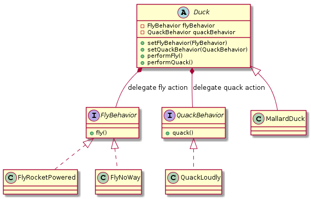

# HeadFirstDesignPatterns

This is the example/trial codes I write while reading the book: *Head First Design Pattern*.

## Chapter 1: StrategyPattern
Delegate some behaviors to some other class by composition.
Composition makes it possible to change the behavior in runtime, but it also require us to write a lot wrapper functions. 
