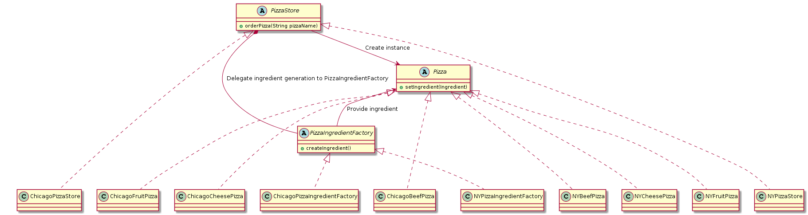

# HeadFirstDesignPatterns

This is the example/trial codes I write while reading the book: *Head First Design Pattern*.

## Chapter 1: Strategy Pattern
Delegate some behaviors to some other class by composition.
Composition makes it possible to change the behavior in runtime, but it also require us to write a lot wrapper functions. 

## Chapter 2: Observer Pattern
Register an object implementing the Observer interface, and call its update method when need to notify it that something has happened.

## Chapter 3: DecoratorPattern
Wrap a method, adding some additional functions.

## Chapter 4: FatoryMethodPattern
Encapusulate the concrete class creation into interfrace method, so the client codes could create object from interfaces.

